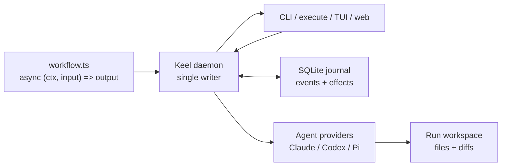
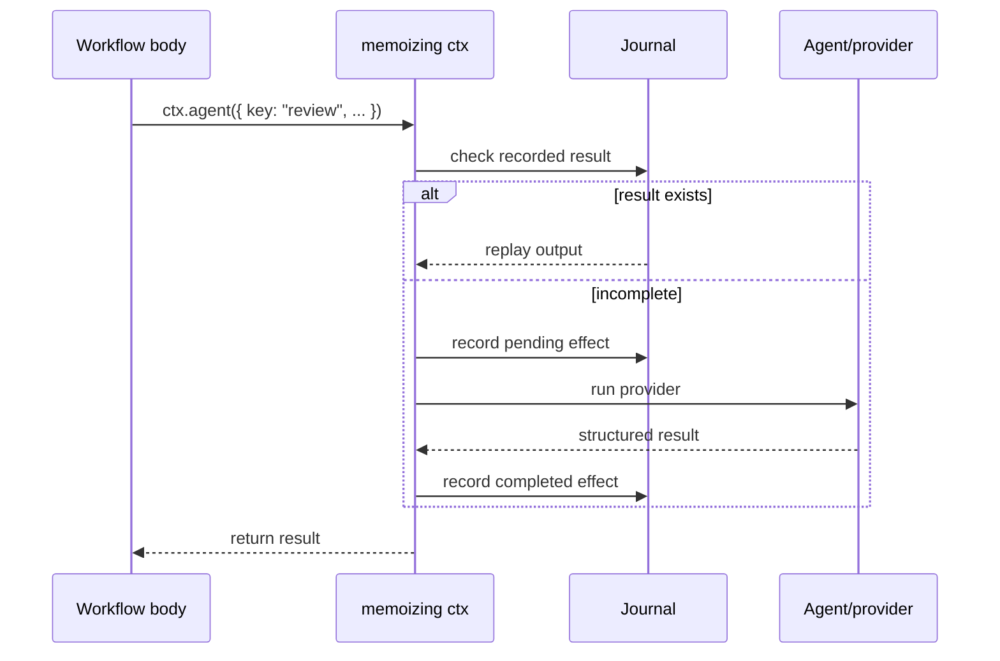

# Keel

> **Warning**
> Keel is experimental personal software. APIs, workflow semantics, CLI output,
> storage formats, and operational behavior may change without a compatibility
> guarantee.

**Keel** is a local-first durable workflow runtime for agent-heavy work. A
workflow is a plain TypeScript function, but every external effect goes through
`ctx.*` and is journaled by a single-writer Bun daemon. When a process crashes or
a run is resumed later, Keel re-runs the workflow body with a memoizing `ctx`:
completed effects replay from the journal, and only incomplete or invalidated
work runs again.

That gives you imperative code for orchestration, durable execution for long
agent jobs, and one canonical run projection for CLI, TUI, web, and future agent
surfaces.

**Using it?** Start with **`USAGE.md`** — the operational reference for install,
CLI commands, paths, workflow APIs, agents, capabilities, scheduling, HITL, time
travel, and daemon behavior.

## How It Fits Together



The daemon owns execution. Clients submit workflow source, send signals, watch
events, and inspect projections; they do not reconstruct state independently.



## Workflow Examples

```ts
import { jsonSchema, type Ctx } from "@kcosr/keel";

const Output = jsonSchema<{ doubled: number }>({
  type: "object",
  properties: { doubled: { type: "number" } },
  required: ["doubled"],
  additionalProperties: false,
});

export default async function workflow(ctx: Ctx, input: { n: number }) {
  return ctx.step("double", Output, { n: input.n }, ({ n }) => ({
    doubled: n * 2,
  }));
}
```

Run it:

```bash
keel launch ./double.workflow.ts --input '{"n":3}'
```

Agent workflows can fan out to multiple reviewers, then pass their structured
outputs into a follow-up agent call:

```ts
import { jsonSchema, type Ctx } from "@kcosr/keel";

const Review = jsonSchema<{ summary: string; risks: string[] }>({
  type: "object",
  properties: {
    summary: { type: "string" },
    risks: { type: "array", items: { type: "string" } },
  },
  required: ["summary", "risks"],
  additionalProperties: false,
});

const Decision = jsonSchema<{ highestRisk: string; recommendation: string }>({
  type: "object",
  properties: {
    highestRisk: { type: "string" },
    recommendation: { type: "string" },
  },
  required: ["highestRisk", "recommendation"],
  additionalProperties: false,
});

export default async function workflow(ctx: Ctx, input: { diff: string }) {
  const [correctness, maintainability] = await Promise.all([
    ctx.agent({
      key: "correctness-review",
      profile: "codex-default",
      prompt: `Review this diff for correctness bugs:\n\n${input.diff}`,
      schema: Review,
    }),
    ctx.agent({
      key: "maintainability-review",
      profile: "claude-default",
      prompt: `Review this diff for maintainability risks:\n\n${input.diff}`,
      schema: Review,
    }),
  ]);

  return ctx.agent({
    key: "synthesize-review",
    profile: "codex-default",
    prompt: [
      "Choose the highest-risk issue and recommend the next action.",
      JSON.stringify({ correctness, maintainability }, null, 2),
    ].join("\n\n"),
    schema: Decision,
  });
}
```

## Where To Go

| Need | Start here |
|---|---|
| Use Keel, run workflows, inspect commands/API, understand paths and daemon state | [`USAGE.md`](./USAGE.md) |
| Write your first workflow or author workflows as an agent | [`SKILL.md`](./SKILL.md) |
| Launch reusable operational workflows | [`workflows/README.md`](./workflows/README.md) |
| Work in this repo safely: migrations, changelog, compatibility, capability rules | [`AGENTS.md`](./AGENTS.md) |
| Decide which docs to update when behavior changes | [`docs/documentation.md`](./docs/documentation.md) |
| Understand daemon API operation families | [`docs/api.md`](./docs/api.md) |
| Understand event stream cursors, durable frames, and stream boundaries | [`docs/events.md`](./docs/events.md) |
| Track operation exposure across CLI, execute, TUI, API, and planned surfaces | [`docs/control-surfaces.md`](./docs/control-surfaces.md) |
| Understand architecture, tradeoffs, historical design decisions, and acceptance workload | [`DESIGN.md`](./DESIGN.md) |
| See user-visible changes over time | [`CHANGELOG.md`](./CHANGELOG.md) |

`DESIGN.md` is no longer the day-to-day usage reference. Treat it as the
architecture and design-history record: useful for why the system has this shape,
but not the authoritative command/API lookup.

## Status

Keel is active local-first infrastructure for durable agent workflows. It has a
working daemon, CLI, workflow SDK, journal, replay model, durable waits,
agent-provider integrations, reusable workflow registry, run workspaces, and
operator controls. A local React web console is available through `keel web`
when `web/dist` has been built; it covers live runs, approvals, workspaces,
saved workflows, read-only schedules, profiles, settings, and system status at
the current API baseline, with copyable CLI equivalents for browser actions.
Some planned surfaces, especially MCP and richer web mutations, remain deferred.
See [`USAGE.md`](./USAGE.md#known-limitations) and
[`docs/control-surfaces.md`](./docs/control-surfaces.md).

Run the local checks:

```bash
bun install
bun test
bun run typecheck
bun run lint
bun run web:build
bun run web:test
```

Live backend smokes are gated behind `KEEL_LIVE=1`; see `USAGE.md` for provider
setup and operational details.
